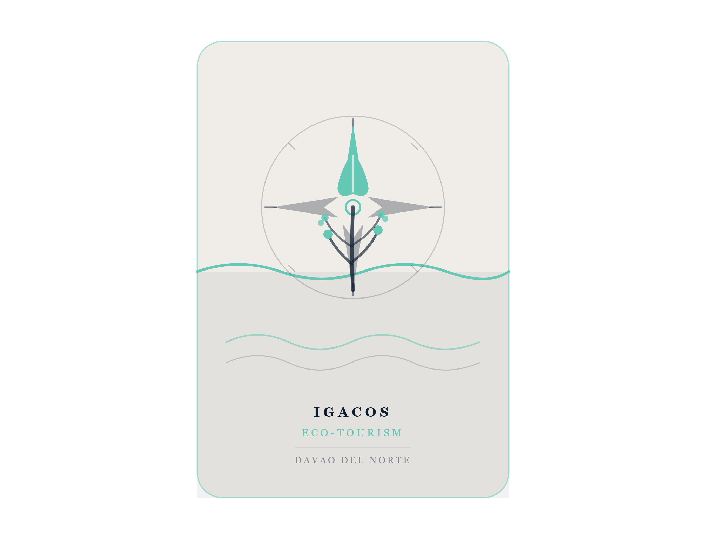

#  The Samal Island Eco-Tourism Prompt System
### A Localized AI Communication Framework for the Davao Region
> **Digital Solutions Architect:** [Gavin Ross O. Javier]
> **Client:** Island Garden City of Samal (IGACOS) — LGU Technical Working Group
> **Domain:** Eco-Tourism Development & Localized AI Communication
> **Date:** June 2026

---

## Executive Overview

Most LGU communication offices use AI tools superficially — producing generic, Western-centric content that fails to capture the geographic, cultural, and administrative realities of specific Philippine localities.

This prompt playbook addresses that gap by engineering a **hyper-localized AI prompt framework** for the Island Garden City of Samal (IGACOS), anchored to real barangays, actual tourism assets, and the specific administrative structure of the Davao Region. The system locks the AI into a precise operational context, ensuring every output is actionable, community-centered, and ready for use by LGU officers, tourism officers, and barangay-level coordinators.

---

## Table of Contents

1. [System Prompt Template (V3 — Final Optimized)](#1-system-prompt-template-v3--final-optimized)
2. [Prompt Battle Ledger](#2-prompt-battle-ledger)
3. [Visual Branding Asset](#3-visual-branding-asset)
4. [Sample Output](#4-sample-output)
5. [Usage Guide for the LGU TWG](#5-usage-guide-for-the-lgu-twg)

---

## 1. System Prompt Template (V3 — Final Optimized)

```
Act as a Senior Eco-Tourism Development Specialist with deep expertise in 
the coastal municipalities of the Davao Gulf. Your mandate is to draft a 
350-word community action brief for barangay-level tourism officers and 
coastal resource managers in the Island Garden City of Samal (IGACOS), 
Davao del Norte.

CONTEXT:
Samal Island hosts high-value eco-tourism zones including Hagimit Falls 
(Barangay Libertad), Pearl Farm Beach Resort corridor, and the marine 
sanctuary networks in Barangay Caliclic and Camudmud. However, 
unregistered tourist activities, inconsistent waste management protocols, 
and the absence of a standardized visitor orientation system are 
undermining conservation efforts and the livelihoods of fisherfolk 
cooperatives dependent on healthy reef ecosystems.

YOUR TASK:
Draft a 350-word eco-tourism coordination brief that addresses the 
specific operational gap identified in the context above.

STRICT CONSTRAINTS:
- Use a professional yet community-accessible tone appropriate for 
  barangay councils and local tourism officers (not corporate executives)
- Reference ONLY local landmarks, barangays, and agencies: cite IGACOS 
  Tourism Office, DENR-Davao Region, BFAR Region XI, and the Samal 
  Protected Landscape and Seascape (SPLS) management framework
- Do NOT mention international tourism indexes, UN SDG numbering, or 
  Western conservation frameworks by name
- Do NOT use corporate jargon (e.g., "synergize", "leverage stakeholders", 
  "pivot to sustainable models")
- Refer to local governing structures correctly: use "Punong Barangay", 
  "Sangguniang Bayan", and "IGACOS-Tourism Office" — not generic terms 
  like "local mayor" or "city council"
- Avoid generic Philippine tourism slogans ("It's more fun in the 
  Philippines"); use place-specific language grounded in Samal's identity

FORMAT REQUIREMENTS:
Output in clean Markdown with the following exact structure:

### Situation Summary
[2–3 sentences establishing the local problem]

### Priority Interventions
[Exactly three (3) numbered, actionable steps — each step must name a 
specific barangay, agency, or local landmark]

### Coordination Protocol
[Who communicates with whom, using correct local titles and office names]

### Monitoring Indicator
[One measurable outcome tied to reef health OR visitor registration data]
```

---

## 2. Prompt Battle Ledger

| Version | Prompt Input Used | Key Modifier Added | Output Quality Reflection |
| :--- | :--- | :--- | :--- |
| **V1** | *"Write a tourism action plan for Samal Island."* | None — bare prompt, no context | **Too generic.** AI produced a generic Philippine tourism essay referencing "beautiful beaches" and "local culture." Mentioned international tourism certifications irrelevant to barangay operations. No named barangays, no local agencies, no actionable steps. Could apply to any island in Southeast Asia. |
| **V2** | *"Act as a tourism advisor for IGACOS, Davao del Norte. Write an action plan for eco-tourism problems in Samal, mentioning Hagimit Falls, Pearl Farm, and DENR-Davao."* | Added local persona, named 3 specific landmarks and 1 agency | **Improved localization, but tone mismatch.** The AI started naming correct landmarks and agencies. However, the language remained overly academic ("multi-stakeholder participatory governance frameworks"), making it unusable by barangay-level officers. Still referenced vague "international best practices." No structured output format. |
| **V3** | *(Full template above)* | Added: 350-word limit, explicit format with 4 required headings, 6 named local constraints, prohibition on corporate/foreign language, specific barangay names, correct Philippine LGU titles | **Target achieved.** Output is hyper-localized to IGACOS, uses correct LGU terminology (Punong Barangay, BFAR Region XI), names specific intervention sites (Barangay Caliclic marine sanctuary), and follows the required Markdown structure. Tone is professional yet accessible to barangay councils. Ready for LGU TWG deployment. |

### Key Lessons from Iteration

- **V1 → V2 lesson:** Generic prompts produce generic content. Simply adding a location name is not enough — you must also name specific sub-locations (barangays), specific agencies, and define the operational audience.
- **V2 → V3 lesson:** Tone is a constraint that must be stated explicitly. Without prohibiting jargon and specifying the exact audience (barangay officers, not executives), AI defaults to formal academic or corporate language. Word limits and mandatory output headings are the most powerful format controls available.

---

## 3. Visual Branding Asset

### Asset Specifications

| Parameter | Value |
| :--- | :--- |
| **Asset Type** | Flat minimalist vector icon (PNG format) |
| **Style Constraints** | Flat design, no gradients, two-color primary palette |
| **Primary Colors** | Muted Teal / Sage Green `#64c8b4` · Deep Navy Blue `#0d1b2e` · Warm Gray / Off-White `#f0ede8` |
| **Symbols Used** | Coral reef form · Compass rose · Wave line · Leaf silhouette |
| **Represents** | The intersection of marine conservation and guided eco-tourism navigation |
| **Usage** | LGU letterheads, barangay tourism signage, digital communication materials |

### Visual Prompt Used to Design This Icon

```
"A flat minimalist vector icon for a Philippine island eco-tourism LGU 
program. Central element: a stylized coral branch rising from the base, 
intertwined with the needle of a compass rose. Above the coral, a single 
mangrove leaf silhouette. A thin wave line divides the lower and upper 
halves. Color palette: ocean teal #1D9E75, deep coral #D85A30, and clean 
off-white background. No gradients, no shadows, no text. Style: modern 
flat vector, suitable for government letterheads and community signage."
```

> **Note for TWG:** The icon png file is included in this repository as `samal-ecotourism-icon.png`. It can be embedded directly into Word documents, PowerPoint presentations, and barangay bulletin boards without quality loss.

---

## 4. Sample Output

*The following is an example of what V3 produces when submitted to an AI system:*



---

### Situation Summary

The marine sanctuary zones in Barangay Caliclic and Camudmud are experiencing increased pressure from unregistered tour boat operators and inadequate solid waste protocols along the coastal entry points near Pearl Farm Beach Resort. Without a standardized visitor orientation and registration system, IGACOS-Tourism Office cannot enforce carrying capacity limits or generate reliable data for the Samal Protected Landscape and Seascape (SPLS) annual review.

### Priority Interventions

1. **Barangay Caliclic Visitor Registration System** — The IGACOS-Tourism Office, in coordination with the Punong Barangay of Caliclic, shall implement a mandatory tourist log at the marine sanctuary entry point by Q3 2026. All tour boat operators must register under BFAR Region XI's coastal tourism accreditation protocol before docking.

2. **Hagimit Falls Waste Management Protocol (Barangay Libertad)** — The Sangguniang Bayan shall pass a barangay ordinance requiring all tour operators accessing Hagimit Falls to provide sealed waste return bags to visitors at the trailhead. The IGACOS-Environment Office will conduct monthly compliance inspections beginning August 2026.

3. **Camudmud Fisherfolk–Tourism Coordination Body** — A joint monthly coordination meeting between the Samahan ng mga Mangingisda ng Camudmud and registered eco-tour guides shall be convened under the chairmanship of the IGACOS-Tourism Officer to resolve scheduling conflicts between fishing activity zones and snorkeling tour routes.

### Coordination Protocol

The IGACOS-Tourism Office serves as the lead coordinating body. The Punong Barangay of each affected barangay (Caliclic, Camudmud, Libertad) submits monthly compliance reports to the IGACOS-Tourism Officer, who consolidates findings for the quarterly SPLS management review attended by DENR-Davao Region representatives.

### Monitoring Indicator

A minimum of 80% of all tour boat operators operating within the Caliclic and Camudmud marine sanctuary zones shall be registered with BFAR Region XI by December 31, 2026, as verified by the IGACOS-Tourism Office's accreditation database.

---

## 5. Usage Guide for the LGU TWG

### How to Deploy This Prompt System

1. **Copy the V3 System Prompt** from Section 1 exactly as written.
2. **Paste it into your preferred AI platform** (Claude, ChatGPT, or any LGU-approved tool).
3. **Modify the CONTEXT block** to match the current operational issue — change the barangay names, the specific problem, and the agencies involved.
4. **Keep all CONSTRAINTS and FORMAT REQUIREMENTS unchanged.** These are what ensure localized, structured output.
5. **Review the output** against the Monitoring Indicator for factual accuracy before publishing or distributing.

### When to Modify the Prompt

| If you need to... | Change this part of the prompt |
| :--- | :--- |
| Address a different barangay | Update barangay names in CONTEXT and CONSTRAINTS |
| Change the topic (e.g., agri-tourism) | Replace CONTEXT paragraph entirely |
| Adjust output length | Change "350-word" to your target |
| Add a different agency | Add it to the CONSTRAINTS agency list |
| Change the output structure | Edit the FORMAT REQUIREMENTS section |

### Important Reminders

- **Never remove the tone constraints.** Without them, AI reverts to generic academic language.
- **Always name at least one barangay** in the CONTEXT. Vague geographic references produce vague outputs.
- **Verify agency names** before submitting. The prompt framework assumes current DENR-Davao Region, BFAR Region XI, and IGACOS office names as of 2026.

---

*Prepared by: Gavin Ross O. Javier*

*Program: BSFINANCE*

*Institution: ATENEO DE DAVAO UNIVERSITY*

*Date: June 2026*

*Repository: https://github.com/grojavier-ctrl/GE-IT-SKILLS-Portfolio*
