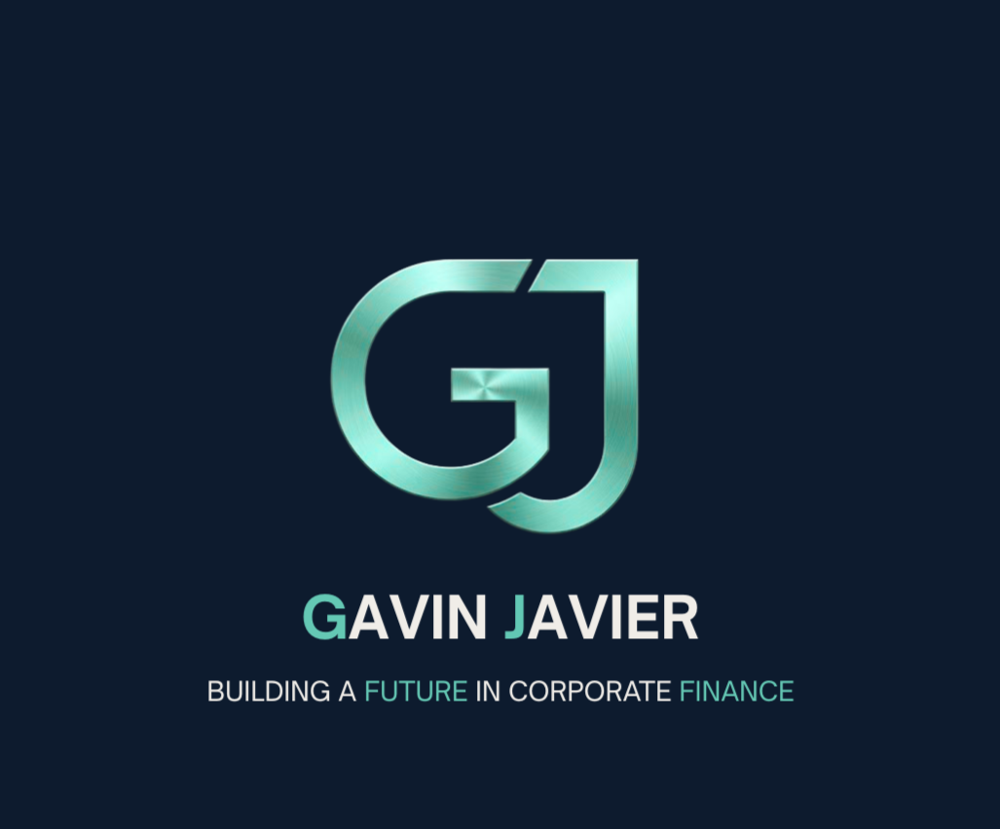
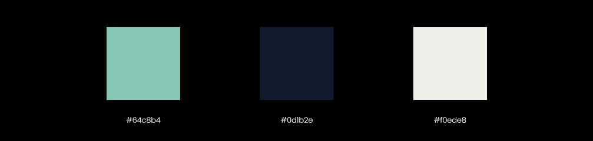
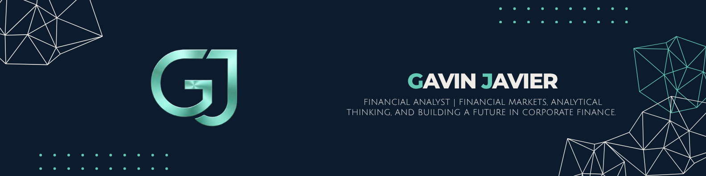
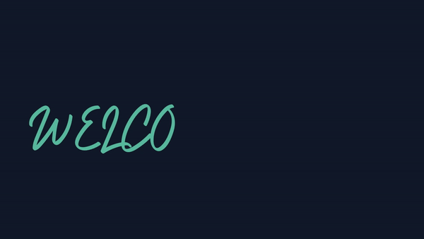

# Gavin Javier — Portfolio

> **"Building a future in corporate finance."**

---

## About Me

Greetings! I am Gavin Javier, I have a huge passion for everything finance related. I can do financial modeling, financial statement analysis and reporting. I'm currently building my foundations in accounting, investments, and corporate finance and working toward becoming the kind of analyst who turns numbers into strategy.

---

## Projects

### Project 1 — Branding

> 📄 [C.R.A.P. Principles](Brand-assets/C.R.A.P.%20Principles%20-JAVIER.pdf)

I designed this as a personal resume applying the C.R.A.P. principles — Contrast, Repetition, Alignment, and Proximity. I used a dark navy background with teal typography to create strong contrast and a professional, finance-forward aesthetic. The layout groups related content into clear sections so the hierarchy is immediately readable.

---

### Project 2 — Social Media Bundle

Both pieces use a consistent dark navy and teal color scheme that reflects the tone of the finance industry — trustworthy, clean, and modern. The profile banner keeps it minimal with the GJ monogram logo and title, while the promotional graphic expands the brand with a services breakdown. Keeping both visually unified ensures a cohesive personal brand across platforms.

---

### Project 3 — Infographics

This infographic tackles the problem of hidden subscription spending, a topic that ties directly into personal financial awareness. I structured it as a top-down narrative — starting with the problem, moving to why 
existing tools fail, then presenting a fintech solution — so the data tells a complete story. The dark theme with teal accents keeps it consistent with my overall brand while making the statistics pop visually.

---

### Project 4 — Interactive Interaction & Motion

> 📥 [Download Full Video](media/Javier_introduction.mp4)

This piece explores how motion and interactivity can bring a personal brand to life beyond static design. I focused on smooth transitions and purposeful animation to guide the viewer's attention without overwhelming the content. The goal was to make the introduction feel dynamic and professional, reflecting the same polished identity carried throughout the rest of the portfolio.

---

### Project 5 — Prototyping

> 📄 [Download it the full prototype here](media/Javier_Canva_Prototype.docx)  

This prototype maps out the user experience of a finance-focused personal brand page, testing how layout and flow affect how viewers engage with my work. I used Canva to rapidly prototype the structure before committing to a final design, which helped me refine the placement of key sections like services and contact. The process reinforced how important it is to think through the user journey before designing for aesthetics.

---

## Repository Structure

| Folder | Contents |
|--------|----------|
| `/Brand-assets` | Logo, headers, color sheets |
| `/Visuals` | Social graphics, banners |
| `/docs` | Infographics, brief reports |
| `/media` | Videos or prototype links |

---

